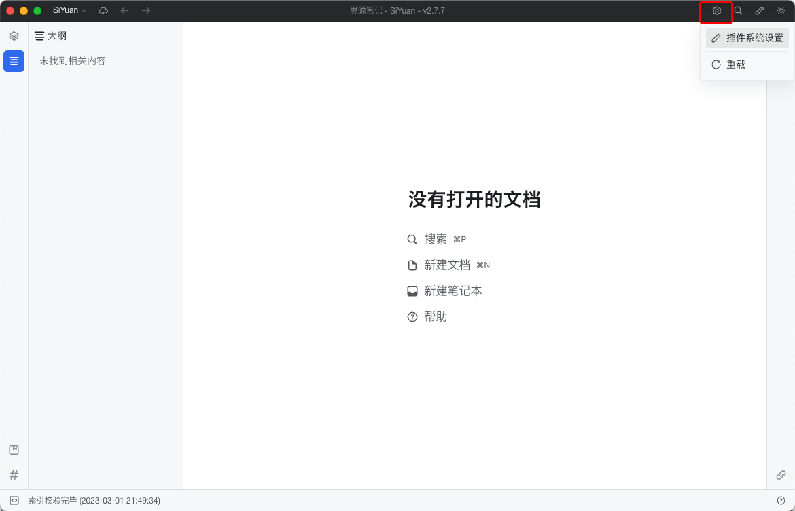
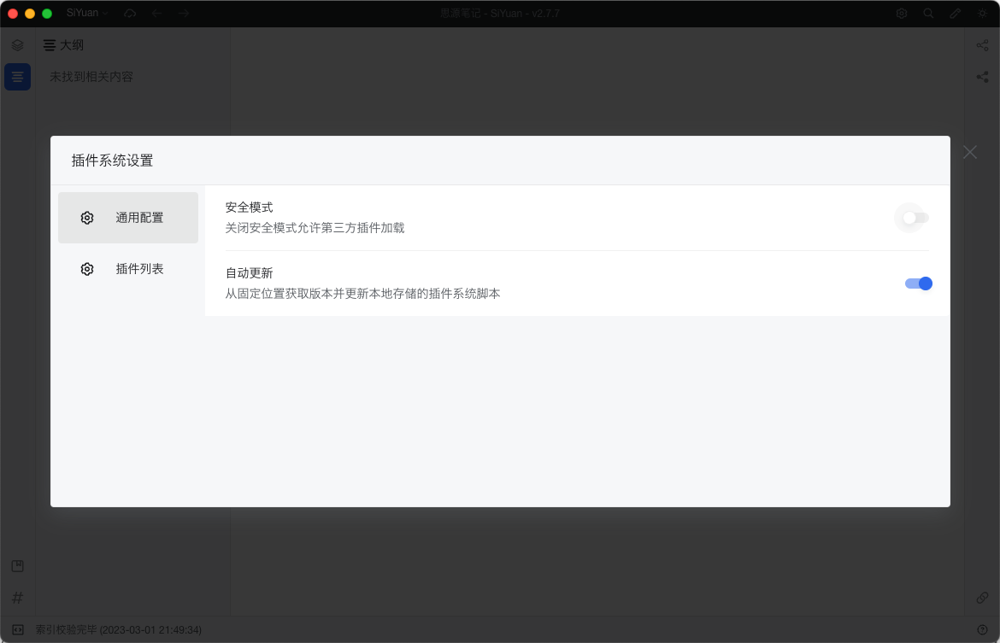
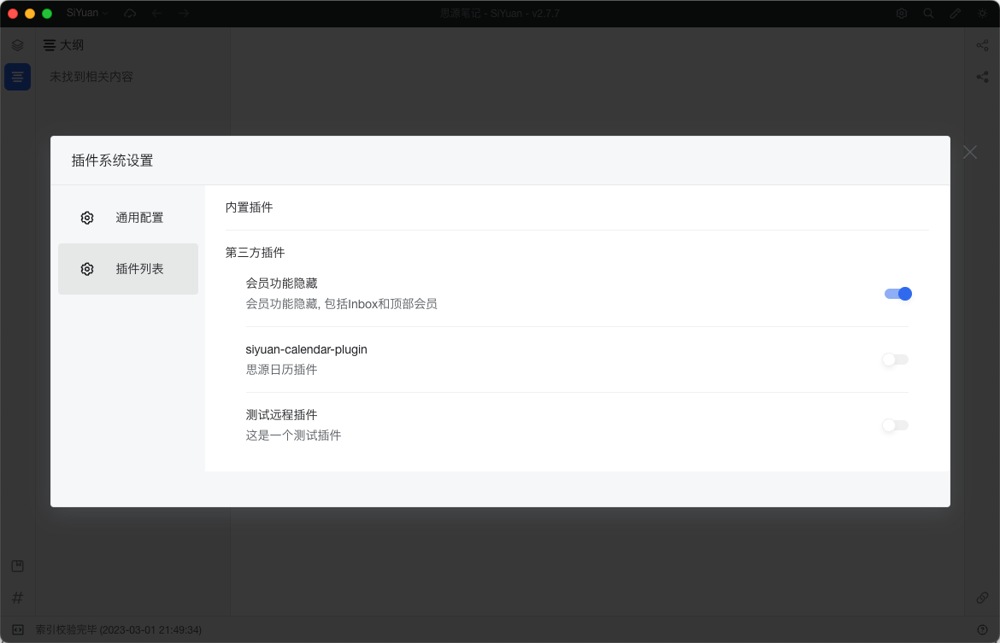

# Siyuan Plugin System

[中文版本](./README_zh.md)

A plugin system based on 'Code Snippet' function in Siyuan, which a local note system like 'Notion'.

## Install
Add the [`load.js`](./load.js) content to JS snippets in setting and enable it. Reload the Siyuan to finish auto install.

## Plugins
[zuoez02/siyuan-plugins](https://github.com/zuoez02/siyuan-plugins)

Here are some plugins maybe you can use. :)

## Roadmap

[Project Siyuan Plugin System](https://github.com/users/zuoez02/projects/1)

## Preview

*Plugin system entry*

*Plugin system setting*

*Plugin system plugin list*

